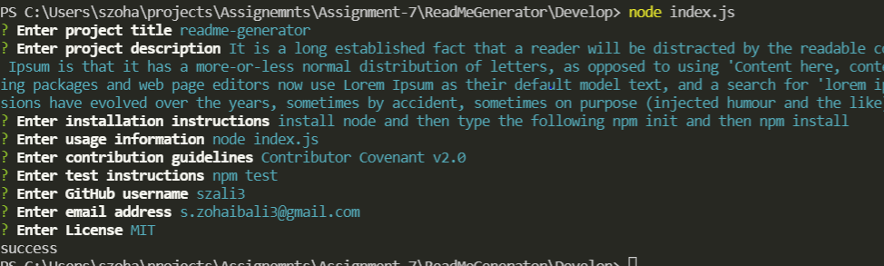

# readme-generator

## Summary  

The project will use node and inquirer. Will ask series of question and then create README.md file base on the user input. 

## Instalation

install Node. After install node type the following
npm init
npm install

## Tools used

HTML, CSS, JavaScript, Node, Inquirer.

## Contributors

Zohaib Ali

    